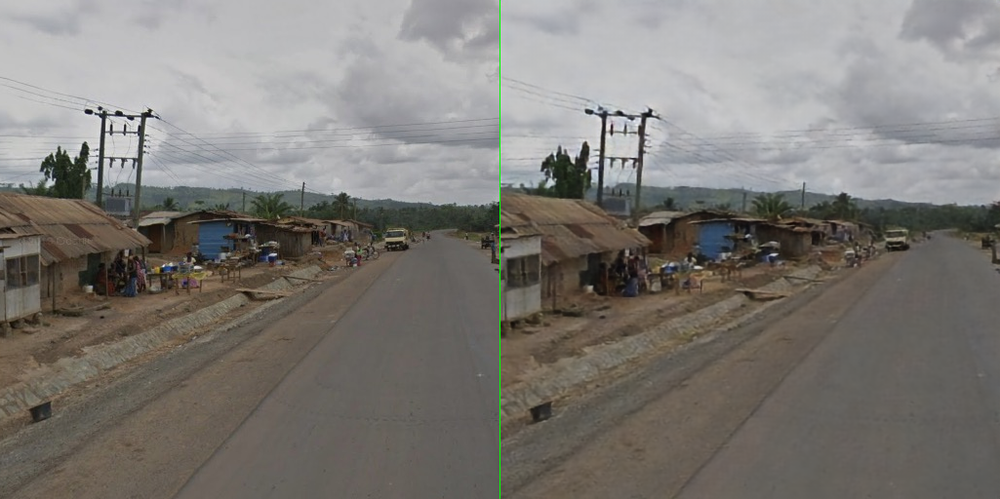
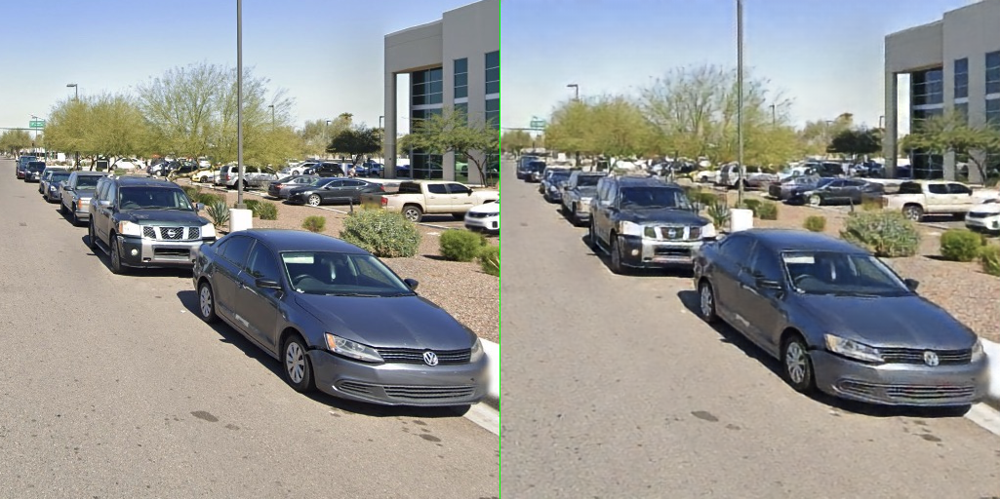

# mlx-vqvae 2

An MLX implementation of [VQ-VAE-2](https://arxiv.org/abs/1906.00446). I trained a two layer model locally on my M3 macbook on my [Google Streetview images dataset](https://huggingface.co/datasets/deboradum/GeoGuessr-coordinates), containing 100,000+ 1600x900 images of random streetview locations from all over the world.
Due to hardware limitations I could only train with a batch size of 4, however after only five epochs results were quite good:

_Left: original image. Right: VQVAE reconstructed image_

_Left: original image. Right: VQVAE reconstructed image_

You can also train a three layer model by passing "large" as an argument to `train.py`. The larger three layer VQ-VAE is capable of capturing more fine grained details, see the original paper for more information. 